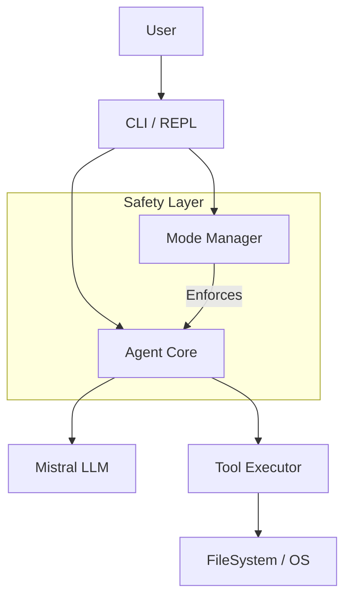

# ChefChat Codebase Explanation & Walkthrough

## 1. Introduction
**ChefChat** is a superior fork of the Mistral Vibe CLI, designed to be the definitive, "production-ready" yet "delightfully fun" AI agent CLI experience. It distinguishes itself through rigorous safety mechanisms (ModeManager), a polished user interface (Rich + prompt_toolkit), and a robust, modular architecture.

## 2. High-Level Architecture
The application follows a clean separation of concerns between the **CLI (User Interface)** and the **Core (Logic/Intelligence)**.

### Key Subsystems:
1.  **The REPL (Read-Eval-Print Loop)**: The interactive frontend using `prompt_toolkit` for input and `rich` for rendering.
2.  **The Agent**: The capabilities engine that converses with the LLM and orchestrates tasks.
3.  **The Mode Manager**: A safety gatekeeper that enforces read-only vs. write-access states.
4.  **The Tool Executor**: Handles the actual execution of side-effects (file writing, shell commands).

---

## 3. Directory Structure & Key Components

The codebase is organized under the `vibe/` package.

### `vibe/core/` - The Brains
This directory contains the business logic, independent of the UI.

*   **`vibe/core/agent.py`**: The heart of the system. It manages the conversation loop, calls the LLM, and decides whether to execute tools. It consults the `ModeManager` before allowing any tool execution.
*   **`vibe/core/mode_manager.py`**: Defines the modes (`PLAN`, `EXECUTE`, `ARCHITECT`). It acts as a gatekeeper, determining if a tool is allowed in the current mode (e.g., blocking file writes in `PLAN` mode).
*   **`vibe/core/config.py`**: The single source of truth for configuration. It loads settings using Pydantic.
*   **`vibe/core/system_prompt.py`**: Manages the construction of the system prompt sent to the LLM, which varies based on the current mode (e.g., the AI behaves differently in `ARCHITECT` mode vs `EXECUTE` mode).
*   **`vibe/core/error_handler.py`**: A centralized place for handling exceptions and displaying them nicely.

### `vibe/cli/` - The Interface
This directory handles user interaction and presentation.

*   **`vibe/cli/repl.py`**: The main interactive loop. It handles user input, keybindings (like `Shift+Tab` to switch modes), and renders the output.
*   **`vibe/cli/entrypoint.py`**: The CLI entry point (using `typer`). It parses command-line arguments and launches the REPL.
*   **`vibe/cli/plating.py`**: "Plating" refers to the visual presentation. This file contains helper functions for rendering beautiful UI elements using `rich` (panels, tables, status bars).
*   **`vibe/cli/easter_eggs.py`**:  Adds personality to the tool with commands like `/chef` (help), `/wisdom` (random quotes), and `/roast` (critique).
*   **`vibe/cli/mode_errors.py`**:  Specific logic for handling and explaining errors when a user tries to do something forbidden by the current mode.

---

## 4. Core Concepts Deep Dive

### The Mode System
ChefChat operates in distinct modes to prevent accidents and guide behavior:
*   **PLAN (Blue)**: Read-only. The agent can read files and think, but cannot change anything. Safe for exploration.
*   **ARCHITECT (Magenta)**: Design mode. functionality similar to PLAN but with a system prompt optimized for high-level architectural thinking.
*   **EXECUTE (Red)**: Full access. The agent can write files, run commands, and install packages. Requires caution.

### The "Plating" (UI Philosophy)
The name "ChefChat" implies a focus on presentation. The UI uses:
*   **Spinners**: To show activity during network calls.
*   **Rich Panels**: To frame important information.
*   **Color coding**: Blue for Plan, Red for Execute, to give immediate visual context.

---

## 5. Typical Data Flow (Life of a Command)

1.  **Input**: User types "Refactor utils.py" in the REPL.
2.  **Processing**: `repl.py` captures the input and passes it to the `Agent`.
3.  **Thinking**: The `Agent` sends the message + system prompt (from `system_prompt.py`) to the Mistral API.
4.  **Decision**: The LLM replies with a tool call (e.g., `write_to_file("utils.py", ...)`).
5.  **Gatekeeping**:
    *   The `Agent` checks `ModeManager`.
    *   If Mode is `PLAN`: The tool is **BLOCKED**. The user gets a "Use Execute Mode" warning via `mode_errors.py`.
    *   If Mode is `EXECUTE`: The tool is **ALLOWED** (potentially pending user confirmation).
6.  **Execution**: `agent_tool_executor.py` runs the tool.
7.  **Feedback**: `plating.py` renders the success/failure result nicely to the console.

## 6. Development & Workflows
*   **Testing**: Located in `tests/`. Logic tests in `tests/chef_unit/`, integration in `tests/integration/`.
*   **Workflows**: Automated tasks defined in `.agent/workflows/`.
