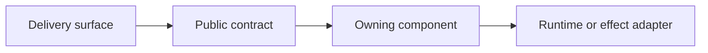

# Design Proposal: <Title>

**Tracking issue:** <link or Not created>

---

## 1. Background

Explain the user or system context, why this work is being considered now, and
the authoritative product requirements or accepted decisions. Link those
sources.

## 2. Problem

State the concrete gap in current behavior and its impact. Separate observed or
source-confirmed limitations from hypotheses.

## 3. Goals

- Describe measurable outcomes this design must achieve.

## 4. Non-Goals

- State adjacent work this proposal intentionally does not own.

## 5. Terminology and Constraints

Define ambiguous terms, invariants, compatibility constraints, platform
requirements, and decisions already made.

## 6. Current System and Evidence

Trace the production composition and request path. Name current owners, public
contracts, persisted state, and important failure behavior. Link exact source
files, tests, specifications, and runtime evidence.

Use an evidence table when several claims affect the design. Omit it when a
short paragraph is clearer.

| Observation | Source | Verification status | Design consequence |
| :--- | :--- | :--- | :--- |
| <current behavior> | <source, test, or run link> | Source-confirmed / Test-confirmed / Runtime-verified | <constraint or decision caused by this evidence> |

## 7. Proposed Design

### 7.1 Decision Summary and High-Level Overview

State the selected decisions and their consequences. Then describe one normal
end-to-end path. Do not repeat the rationale from the alternatives section.
Explain the normal path before failure cases.

### 7.2 User and Product Behavior

Describe the visible workflow, defaults, affordances, progress, errors,
cancellation, retries, and degraded behavior.

### 7.3 Architecture and Ownership

Name the owner of each policy, state transition, effect, and persisted record.
Show dependency direction and composition or selection boundaries.

Delete the diagram when it adds no information beyond the prose.

### 7.4 Contracts and Data

Specify proposed APIs, routes, commands, events, models, versioning, validation,
and redaction. Clearly distinguish new shapes from existing ones.

### 7.5 Lifecycle, State, and Concurrency

Describe ordering, state transitions, locks or serialization, idempotency,
interrupts, cancellation, shutdown, and restart/recovery behavior.

### 7.6 Failure Semantics

Cover validation failures, unavailable dependencies, partial success, retries,
timeouts, cleanup, and what remains active or persisted after each failure.
Keep a case in the review path when it changes the design or prevents serious
security, authorization, data-loss, or repeated-effect risk. Put lower-impact
cases that require separate behavior in implementation details. When one rule
already determines the safe response, state the rule once and test
representative cases instead of listing every permutation.

| Failure point | Caller result | Durable state | Recovery or retry |
| :--- | :--- | :--- | :--- |
| <failure> | <typed/public result> | <state after failure> | <next action> |

### 7.7 Compatibility and Migration

Describe coexistence, feature or process selection, old data or wire handling,
rollout ordering, fallback policy, and the removal condition for temporary
compatibility code.

### 7.8 Observability, Privacy, and Security (When Applicable)

Include this section only when the feature introduces a relevant behavior,
risk, or operational need. Otherwise, omit it.

- For security, name the changed trust boundary, authorization decision,
  credential flow, untrusted-input path, or access to protected data and where
  the design enforces the response.
- For privacy, name the user or sensitive data that the feature collects,
  sends, stores, retains, or logs differently and what happens to it.
- For observability, name the feature-specific event or failure, the signal
  that records it, and what an operator can do with that information.

Do not repeat inherited controls or add generic requirements such as "add
logs", "track latency", or "emit metrics".

## 8. Implementation Plan

Break the work into vertical slices. For each slice, name its user-visible or
contract proof, owning package, likely files, dependencies, and exit criteria.

| Slice | Behavior proved | Owner and likely files | Exit criteria |
| :--- | :--- | :--- | :--- |
| 1 | <small end-to-end path> | <package and files> | <observable result> |

Call out any ADR, generated artifact, release note, documentation, or sibling
repository update required by the design.

## 9. Validation Plan

Start with a short, visible checklist of the conditions required to complete
the work. Reference earlier sections instead of repeating their details.

- Every implementation slice meets its exit criteria.
- The detailed validation checks below pass.
- Required migrations, generated artifacts, documentation, ADRs, release notes,
  and sibling-repository updates are complete.
- Deferred compatibility removal has a named owner and removal condition.
- No material decision or implementation blocker remains unresolved.

Detailed validation checks

Map every goal and material failure mode to an executable check. Include exact
commands only after verifying them in the current checkout.

| Requirement or risk | Test level | Path or command | Expected result |
| :--- | :--- | :--- | :--- |
| <goal or failure> | Unit / Contract / Integration / End-to-end / Manual | <verified location> | <observable assertion> |

Distinguish source review, focused tests, full suites, CI frontiers, and live
runtime validation. Define the complete acceptance boundary.

## 10. Alternatives

| Option | Advantages | Costs and risks | Decision crux |
| :--- | :--- | :--- | :--- |
| <chosen option> | <benefits> | <tradeoffs> | <why it wins> |
| <alternative> | <benefits> | <tradeoffs> | <why rejected> |

Explain why the selected option wins and which tradeoff the team accepts.

## 11. Rollout and Document Lifecycle

- **Release plan:** <ordering, gating, and rollback>
- **Compatibility removal:** <condition and owner>
- **Monitoring plan, when applicable:** <feature-specific signals and response>
- **Document lifecycle:** <retain, replace with ADR, or remove after completion>

---

## Appendix

Every appendix section is optional. Include only sections that add information
beyond the main document, and omit the appendix when none apply.

### Implementation Reference

Use this section for exact implementation material that spans several design
sections or would make the relevant section hard to follow. Omit it when
collapsible sections already contain that material, and do not repeat the same
content in both places.

This material can include data classes, JSON documents, stored formats, method
signatures, protocol field mappings, naming and hashing rules with example
inputs and outputs, and platform-specific algorithms.

### Source Map

Include this section when the work spans enough modules, packages, or
repositories that a consolidated navigation list helps the implementer or
`/goal` agent. Otherwise, omit it.

- `<path>` - <ownership or relevance>
