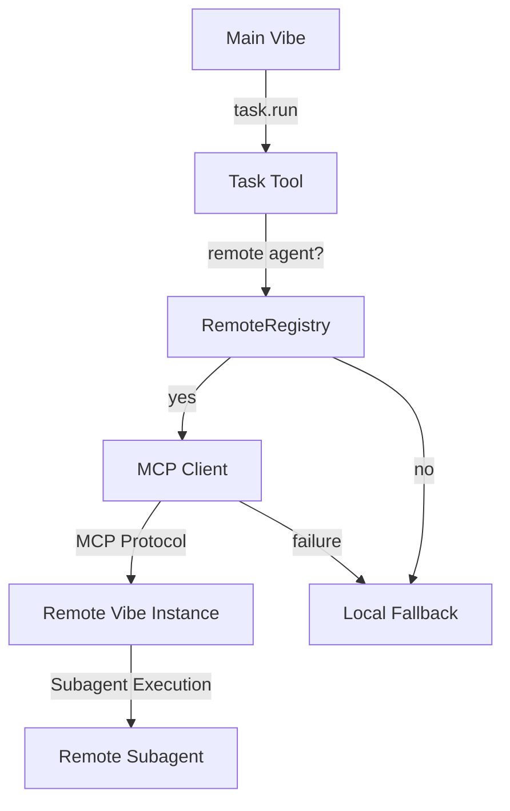

# Remote Subagent Execution for Vibe

## Overview

Vibe now supports **distributed workload execution** across multiple Vibe instances using the **MCP (Mistral Communication Protocol)**. This enables you to delegate tasks to remote Vibe instances, distributing computational load and leveraging specialized hardware or environments.

## Key Features

- **Multi-Server Support**: Manage multiple remote Vibe instances
- **Flexible Addressing**: Simple `server_name:agent_name` syntax
- **Automatic Fallback**: Graceful degradation to local execution on failure
- **Transport Flexibility**: Support for HTTP, STDIO, and streamable-HTTP
- **Enterprise Reliability**: Comprehensive error handling and validation

## Quick Start

### 1. Configure Remote Servers

Add remote Vibe instances to your configuration:

```toml
# In your vibe.toml or settings
[mcp_servers]

[[mcp_servers]]
name = "main_server"
transport = "http"
url = "http://main.vibe:8080"

[[mcp_servers]]
name = "cloud_server"
transport = "http"
url = "http://cloud.vibe:8080"
```

### 2. Execute Tasks Remotely

Use the enhanced `task` tool with server addressing:

```python
# Execute on specific remote server
task.run(agent="main_server:explore", task="research distributed systems")

# Execute on default remote server (first configured)
task.run(agent="explore", task="general research")

# Execute locally (no remote)
task.run(agent="local_agent", task="local processing")
```

## Addressing System

| Format | Example | Behavior |
|--------|---------|----------|
| `server:agent` | `main_server:explore` | Execute `explore` on `main_server` |
| `server` | `backup_server` | Execute default agent on `backup_server` |
| `agent` | `explore` | Execute on default server (first configured) |
| `local` | `local_agent` | Execute locally (no remote routing) |

## Configuration

### MCP Server Configuration

Configure remote servers in your Vibe settings:

```toml
[mcp_servers]

[[mcp_servers]]
# Required: Unique server name
name = "production_server"

# Required: Transport type (http, streamable-http, stdio)
transport = "http"

# Required for HTTP transports: Server URL
url = "http://vibe-prod:8080"

# Optional: Additional HTTP headers
headers = { Authorization = "Bearer token" }

# Optional: API key configuration
api_key_env = "VIBE_API_KEY"
api_key_header = "X-API-Key"
api_key_format = "Bearer {token}"

# Optional: Timeout settings
startup_timeout_sec = 10.0
tool_timeout_sec = 60.0

# Optional: Sampling permissions
sampling_enabled = true
```

### Transport Types

#### HTTP Transport
```toml
transport = "http"
url = "http://server:port"
```

#### Streamable-HTTP Transport
```toml
transport = "streamable-http"
url = "http://server:port"
```

#### STDIO Transport
```toml
transport = "stdio"
command = ["vibe", "serve", "--stdio"]
args = ["--debug"]
env = { "ENV" = "production" }
```

## Advanced Features

### Automatic Fallback

When remote execution fails, Vibe automatically falls back to local execution for subagents:

```python
# If main_server is unavailable, automatically executes locally
task.run(agent="main_server:explore", task="critical research")
```

### Configuration Validation

Vibe validates your configuration on startup:

- ✅ Duplicate server name detection
- ✅ Transport-specific required fields
- ✅ URL format validation
- ✅ Command validation for STDIO

### Remote Registry

Access the remote registry programmatically:

```python
from vibe.core.mcp.registry import RemoteRegistry

registry = RemoteRegistry(config)

# List available remotes
remotes = await registry.list_available_remotes()

# Get configuration status
status = registry.get_configuration_status()

# Check if agent is remote
is_remote = registry.is_remote_agent("main_server:explore")
```

## Security Considerations

- **Authentication**: Configure API keys and headers for secure communication
- **Transport Security**: Use HTTPS for remote connections
- **Network Isolation**: Place Vibe instances in secure network zones
- **Fallback Safety**: Local fallback maintains productivity during outages

## Troubleshooting

### Common Issues

**No remote servers configured**
```
Error: No remote servers configured and no default available
```
**Solution**: Add at least one MCP server to your configuration.

**Duplicate server names**
```
Error: Duplicate MCP server name: server_name
```
**Solution**: Ensure all server names are unique.

**Missing required fields**
```
Error: MCP server server_name missing URL for HTTP transport
```
**Solution**: Add the required field for the transport type.

**Connection failures**
```
Error: Remote execution failed: Connection refused
```
**Solution**: Check server availability and network connectivity.

## Architecture



## Best Practices

1. **Name Servers Descriptively**: Use meaningful names like `prod_server`, `cloud_server`, `gpu_server`
2. **Configure Timeouts Appropriately**: Adjust based on your network conditions
3. **Use HTTPS**: Always use secure connections for remote communication
4. **Monitor Server Health**: Implement health checks for critical remote instances
5. **Leverage Fallback**: Design tasks to work both remotely and locally when possible

## Examples

### Multi-Server Workflow

```python
# Research on main server
research_results = task.run(agent="main_server:research", task="analyze market trends")

# Data processing on GPU server
data_results = task.run(agent="gpu_server:analyze", task="process large dataset")

# Local summary generation
summary = task.run(agent="summarize", task="create executive summary")
```

### Fallback Example

```python
# This will automatically fall back to local execution if cloud_server is down
# No code changes needed - fallback is automatic for subagents
result = task.run(agent="cloud_server:explore", task="critical analysis")
```

## Performance Considerations

- **Network Latency**: Remote execution adds network overhead
- **Server Capacity**: Distribute load based on server capabilities
- **Fallback Cost**: Local fallback maintains productivity but may have different performance characteristics
- **Connection Pooling**: MCP clients are cached for better performance

## Future Enhancements

- **Auto-discovery**: Automatic detection of available Vibe instances on the network
- **Load Balancing**: Intelligent routing based on server load and capabilities
- **Service Mesh**: Integration with service mesh technologies
- **Monitoring**: Built-in health checks and performance metrics

## Support

For issues with remote execution:

1. Check configuration validation results
2. Verify network connectivity to remote servers
3. Test with local execution first
4. Enable debug logging for detailed troubleshooting

```python
# Enable debug logging
import logging
logging.getLogger("vibe.mcp").setLevel(logging.DEBUG)
```

## Migration Guide

### From Local-Only to Distributed

1. **Add Remote Servers**: Configure at least one remote Vibe instance
2. **Test Connectivity**: Verify remote execution works
3. **Update Task Calls**: Add server prefixes to agent names
4. **Monitor Fallback**: Ensure fallback behavior meets your needs
5. **Gradual Rollout**: Start with non-critical tasks, expand as confidence grows

### Backward Compatibility

All existing code continues to work unchanged:

```python
# This still works exactly as before
task.run(agent="explore", task="local research")

# New remote capability is opt-in
task.run(agent="server:explore", task="remote research")
```

## Reference

### TaskArgs Parameters

| Parameter | Type | Description | Remote Example |
|-----------|------|-------------|---------------|
| `agent` | str | Agent name | `"main_server:explore"` |
| `task` | str | Task description | `"research distributed systems"` |

### Configuration Reference

```toml
[mcp_servers]
# List of remote Vibe instances

[[mcp_servers]]
name = "string"          # Unique server identifier
transport = "http"       # Transport type: http, streamable-http, stdio
url = "string"           # Required for HTTP: Server URL
command = ["string"]     # Required for STDIO: Command to launch
headers = {}              # Optional: Additional HTTP headers
api_key_env = "string"   # Optional: Environment variable for API key
api_key_header = "string" # Optional: Header name for API key
api_key_format = "string" # Optional: Format string for API key
startup_timeout_sec = 10.0 # Optional: Server startup timeout
tool_timeout_sec = 60.0    # Optional: Tool execution timeout
sampling_enabled = true   # Optional: Allow LLM sampling requests
```

## License

This feature is part of Vibe and inherits its license terms. Remote execution maintains all security and privacy guarantees of the core Vibe system.

---

**Need help?** Run `task.run(agent="help:remote", task="explain remote execution")` for interactive assistance.