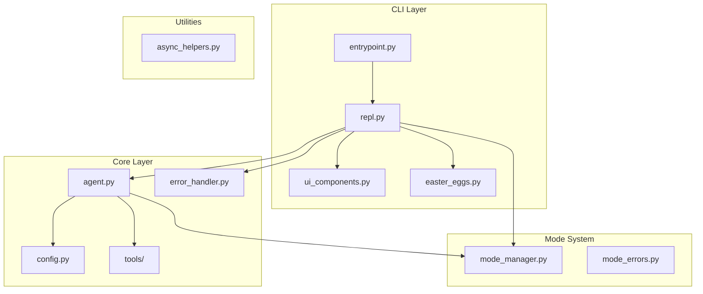
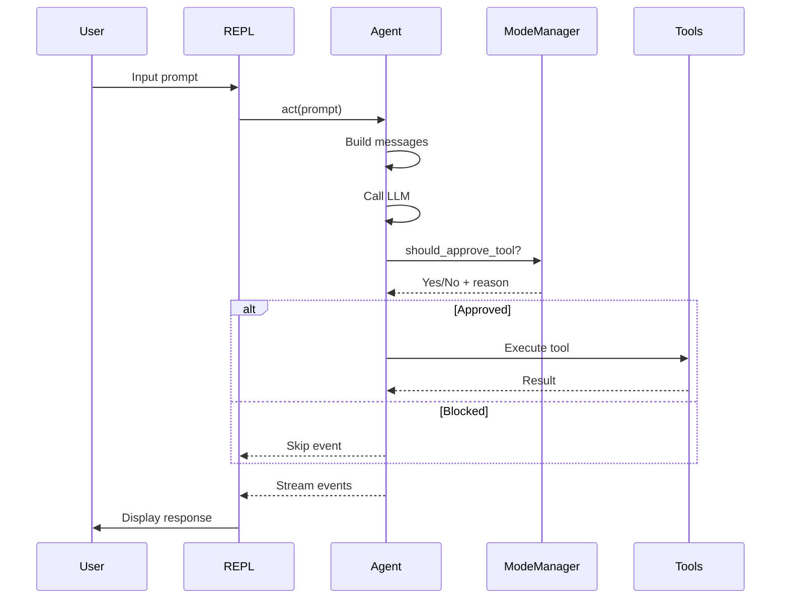
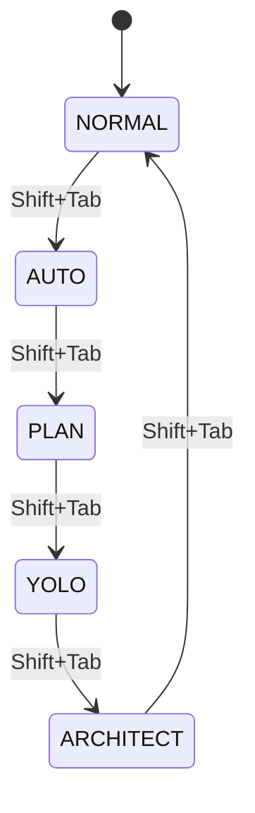

# ChefChat Architecture

This document provides an overview of the ChefChat codebase architecture.

## Overview

ChefChat is a fork of [mistral-vibe](https://github.com/mistralai/mistral-vibe) with enhanced safety features, a premium REPL interface, and "fun" extras like easter egg commands.



---

## Component Breakdown

### CLI Layer (`vibe/cli/`)

| File | Purpose |
|------|---------|
| `entrypoint.py` | Main entry point, CLI argument parsing |
| `repl.py` | ChefChatREPL class — the interactive interface |
| `ui_components.py` | Rich-based UI components (StatusBar, HeaderDisplay, etc.) |
| `easter_eggs.py` | Fun commands (/chef, /wisdom, /roast) |
| `plating.py` | Work presentation formatting |
| `mode_manager.py` | Mode state machine and gatekeeper logic |
| `mode_errors.py` | Mode violation error handling |

### Core Layer (`vibe/core/`)

| File | Purpose |
|------|---------|
| `agent.py` | Agent class — orchestrates LLM and tool execution |
| `config.py` | Configuration loading and validation |
| `error_handler.py` | Centralized error handling with Rich formatting |
| `system_prompt.py` | System prompt generation |
| `tools/` | Tool implementations (bash, file operations, etc.) |

### Utilities (`vibe/utils/`)

| File | Purpose |
|------|---------|
| `async_helpers.py` | Async utilities (run_with_spinner, batch_execute) |

---

## Key Design Decisions

### 1. Mode System

ChefChat implements a 5-mode system for different interaction styles:

| Mode | Auto-Approve | Read-Only | Description |
|------|--------------|-----------|-------------|
| NORMAL | ❌ | ❌ | Default — asks before tool execution |
| AUTO | ✅ | ❌ | Auto-approves all tools |
| PLAN | ❌ | ✅ | Read-only — blocks write operations |
| YOLO | ✅ | ❌ | Full autonomy |
| ARCHITECT | ❌ | ✅ | Read-only design mode |

### 2. Gatekeeper Pattern

The `Agent._should_execute_tool()` method acts as a gatekeeper:

```python
def _should_execute_tool(self, tool_name: str, args: dict) -> tuple[bool, str | None]:
    # 1. Check with ModeManager
    if not self.mode_manager.should_approve_tool(tool_name):
        return False, self.mode_manager.get_block_reason(tool_name, args)

    # 2. Additional safety checks...
    return True, None
```

### 3. REPL Architecture

The REPL uses:
- **prompt_toolkit** for input handling and keybindings
- **Rich** for output formatting and UI components
- **asyncio** for non-blocking agent interaction

```
User Input → ChefChatREPL.run_async() → Agent.act() → [Tool Calls] → Response Display
```

### 4. Error Handling

All errors flow through `ChefErrorHandler`:

```python
from vibe.core.error_handler import ChefErrorHandler

try:
    risky_operation()
except Exception as e:
    ChefErrorHandler.display_error(e, context="Operation Name")
```

---

## Data Flow

### 1. User Request Flow



### 2. Mode Transition Flow



---

## Safety Guarantees

1. **No bypass mechanism** — PLAN and ARCHITECT modes strictly block write operations
2. **Gatekeeper always consulted** — Agent always checks ModeManager before tool execution
3. **Visible mode indicator** — Current mode is always shown in the prompt
4. **Audit trail** — Mode history is tracked in `ModeState`

---

## Testing

```bash
# Run all tests
pytest tests/ -v

# Run mode/safety tests specifically
pytest tests/chef_unit/test_modes_and_safety.py -v

# Run integration tests
pytest tests/integration/test_repl_flows.py -v

# Run benchmark
python scripts/benchmark.py
```

---

## File Structure

```
vibe/
├── cli/
│   ├── entrypoint.py      # Main entry point
│   ├── repl.py            # ChefChatREPL class
│   ├── ui_components.py   # Rich UI components
│   ├── easter_eggs.py     # Fun commands
│   ├── plating.py         # Work formatting
│   ├── mode_manager.py    # Mode system
│   └── mode_errors.py     # Mode error handling
├── core/
│   ├── agent.py           # Agent orchestration
│   ├── config.py          # Configuration
│   ├── error_handler.py   # Error handling
│   ├── system_prompt.py   # Prompt generation
│   └── tools/             # Tool implementations
└── utils/
    └── async_helpers.py   # Async utilities
```

---

## See Also

- [MASTERPLAN.md](../MASTERPLAN.md) — Complete vision document
- [UPSTREAM_DIVERGENCE.md](./UPSTREAM_DIVERGENCE.md) — Fork differences
- [QUALITY_CHECKLIST.md](../QUALITY_CHECKLIST.md) — Pre-release checklist
