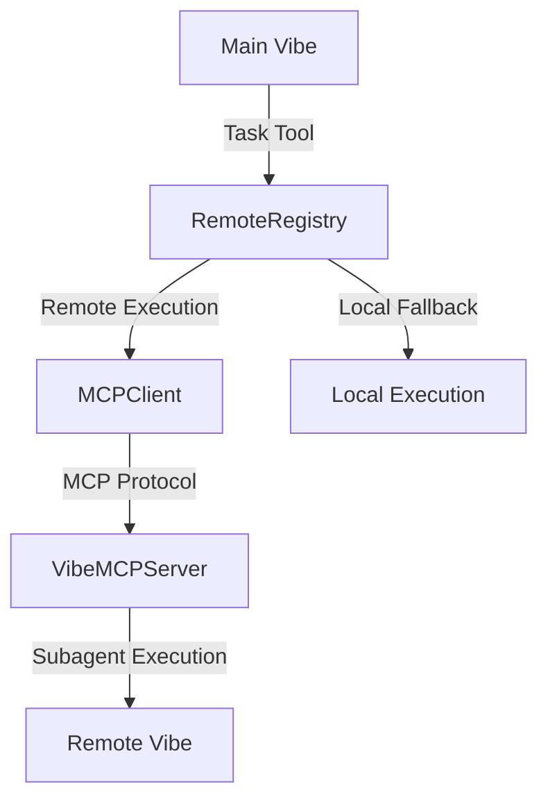

# Vibe MCP Module

## Overview

This module provides **Mistral Communication Protocol (MCP)** integration for Vibe, enabling distributed workload execution across multiple Vibe instances.

## Components

### 1. VibeMCPServer

**Location**: `vibe_server.py`

The MCP server implementation that extends Vibe's capabilities to handle remote subagent execution requests.

**Key Features**:
- Full MCP protocol implementation
- Subagent execution via MCP
- Event streaming between Vibe instances
- Capabilities reporting

**Usage**:
```python
from vibe.core.mcp import create_vibe_mcp_server
from vibe.core.config import VibeConfig

config = VibeConfig.load()
server = create_vibe_mcp_server(config)
# Start the server (typically done by Vibe's main loop)
```

### 2. MCPClient

**Location**: `client.py`

Simple MCP client wrapper for communicating with remote Vibe instances.

**Key Features**:
- Connection management
- Tool execution via MCP
- Event streaming
- Error handling

**Usage**:
```python
from vibe.core.mcp import MCPClient
from vibe.core.config import MCPHttp

server_config = MCPHttp(name="remote", url="http://remote:8080", transport="http")
client = MCPClient(server_config)

# Execute a tool remotely
async for event in client.call_tool("subagent_explore", {"task": "research"}):
    print(event)
```

### 3. RemoteRegistry

**Location**: `registry.py`

Registry for managing multiple remote Vibe instances and their capabilities.

**Key Features**:
- Multi-server management
- Flexible addressing system
- Automatic client caching
- Configuration validation
- Capabilities discovery

**Usage**:
```python
from vibe.core.mcp import RemoteRegistry
from vibe.core.config import VibeConfig

config = VibeConfig.load()
registry = RemoteRegistry(config)

# List available remotes
remotes = await registry.list_available_remotes()

# Execute on specific remote
async for event in registry.execute_on_remote(
    remote_name="main_server",
    tool_name="subagent_explore",
    arguments={"task": "research"}
):
    print(event)
```

## Architecture



## Addressing System

The module implements a flexible addressing system for remote execution:

| Format | Example | Behavior |
|--------|---------|----------|
| `server:agent` | `main_server:explore` | Execute `explore` on `main_server` |
| `server` | `backup_server` | Execute default agent on `backup_server` |
| `agent` | `explore` | Execute on default server (first configured) |
| `local` | `local_agent` | Execute locally (no remote routing) |

## Configuration

### MCP Server Configuration

```toml
[mcp_servers]

[[mcp_servers]]
name = "main_server"
transport = "http"  # http, streamable-http, or stdio
url = "http://main.vibe:8080"

# Optional settings
headers = { Authorization = "Bearer token" }
api_key_env = "VIBE_API_KEY"
startup_timeout_sec = 10.0
tool_timeout_sec = 60.0
sampling_enabled = true
```

### Transport Types

#### HTTP Transport
- Standard HTTP/HTTPS communication
- Best for remote servers on different machines
- Supports authentication and headers

#### Streamable-HTTP Transport
- Enhanced HTTP with streaming support
- Better for long-running tasks
- Maintains persistent connections

#### STDIO Transport
- Standard input/output communication
- Best for local subprocess execution
- Lower overhead than HTTP

## Error Handling & Fallback

The system implements comprehensive error handling with automatic fallback:

### Fallback Scenarios

1. **Connection Failure**: Remote server unavailable
2. **Authentication Failure**: Invalid credentials
3. **Timeout**: Remote execution takes too long
4. **Protocol Error**: MCP communication issues
5. **Server Error**: Remote server internal error

### Fallback Behavior

```python
# This automatically falls back to local execution if remote fails
# Only works for subagents (security constraint)
result = task.run(agent="main_server:explore", task="critical research")

# Check if fallback was used
if result.fallback_used:
    print("Executed locally due to remote failure")
```

## Development Guide

### Adding New MCP Tools

To add new tools that can be executed remotely:

1. **Define the Tool**: Create a standard Vibe tool
2. **Register with MCP**: Add to the MCP tool registry
3. **Handle Remote Execution**: Implement remote execution logic

### Extending the Protocol

To extend MCP functionality:

1. **Add New Handlers**: Implement new MCP message handlers
2. **Update Client**: Add corresponding client methods
3. **Test**: Verify end-to-end functionality

### Testing

The module includes comprehensive tests:

- `test_routing.py`: Basic routing logic
- `test_registry_simple.py`: Registry functionality
- `test_enhanced_features.py`: Configuration validation and fallback
- `test_mcp_server.py`: MCP server functionality

Run tests with:
```bash
uv run python test_*.py
```

## Best Practices

### Configuration

1. **Use Descriptive Names**: `prod_server`, `gpu_server`, `cloud_server`
2. **Configure Timeouts**: Adjust based on network conditions
3. **Secure Connections**: Always use HTTPS for remote servers
4. **Validate Configuration**: Check validation results on startup

### Performance

1. **Connection Pooling**: Reuse MCP clients for better performance
2. **Local Fallback**: Design tasks to work both remotely and locally
3. **Load Distribution**: Balance tasks across available servers
4. **Monitor Health**: Implement health checks for critical servers

### Security

1. **Authentication**: Configure API keys and headers
2. **Network Isolation**: Place servers in secure zones
3. **Input Validation**: Validate all remote inputs
4. **Error Handling**: Don't expose sensitive information in errors

## API Reference

### RemoteRegistry

```python
class RemoteRegistry:
    def __init__(self, config: VibeConfig):
        """Initialize registry with Vibe configuration."""

    def get_remote_names(self) -> list[str]:
        """Get list of configured remote server names."""

    def get_client(self, remote_name: str) -> MCPClient:
        """Get MCP client for a specific remote server."""

    def parse_agent_address(self, agent_spec: str) -> tuple[str, str]:
        """Parse 'server:agent' format into (server, agent)."""

    def is_remote_agent(self, agent_spec: str) -> bool:
        """Check if agent specification refers to a remote agent."""

    async def execute_on_remote(
        self, remote_name: str, tool_name: str, arguments: dict
    ) -> AsyncGenerator[dict, None]:
        """Execute tool on remote server with optional fallback."""

    async def list_available_remotes(self) -> list[dict]:
        """List all available remote servers with status."""

    def get_configuration_status(self) -> dict:
        """Get current configuration status and validation results."""
```

### MCPClient

```python
class MCPClient:
    def __init__(self, server_config: MCPServer):
        """Initialize client for specific MCP server."""

    async def call_tool(
        self, tool_name: str, arguments: dict
    ) -> AsyncGenerator[dict, None]:
        """Call tool on remote server and stream events."""
```

### VibeMCPServer

```python
class VibeMCPServer(Server):
    def __init__(self, config: VibeConfig):
        """Initialize MCP server with Vibe configuration."""

    # MCP Protocol Handlers
    async def _handle_list_prompts(self, request) -> dict:
        """Handle prompt listing requests."""

    async def _handle_get_prompt(self, request) -> dict:
        """Handle prompt retrieval requests."""

    async def _handle_list_tools(self, request) -> dict:
        """Handle tool listing requests."""

    async def _handle_call_tool(self, request) -> AsyncGenerator[str, None]:
        """Handle tool execution requests."""
```

## Troubleshooting

### Common Issues

**Configuration Errors**
- Check `get_configuration_status()` for validation results
- Ensure all required fields are present for the transport type
- Verify server names are unique

**Connection Issues**
- Check network connectivity to remote servers
- Verify server URLs and ports
- Test with local STDIO transport first

**Authentication Issues**
- Verify API keys and headers
- Check environment variables
- Test with authentication disabled temporarily

**Protocol Issues**
- Enable debug logging: `logging.getLogger("vibe.mcp").setLevel(logging.DEBUG)`
- Check MCP protocol version compatibility
- Verify message formats

## Future Enhancements

### Planned Features

1. **Auto-discovery**: Automatic detection of available Vibe instances
2. **Load Balancing**: Intelligent task distribution
3. **Health Checks**: Server health monitoring
4. **Service Mesh**: Integration with service mesh technologies
5. **Metrics**: Performance monitoring and analytics

### Contribution Guidelines

1. **Fork the Repository**: Create your feature branch
2. **Implement Feature**: Follow existing patterns
3. **Add Tests**: Comprehensive test coverage
4. **Update Documentation**: Keep docs in sync
5. **Submit PR**: Include clear description and examples

## License

This module is part of Vibe and inherits its license terms.

## Support

For issues with the MCP module:

1. Check the comprehensive test suite
2. Review the architecture documentation
3. Enable debug logging for detailed information
4. Consult the API reference for usage examples

```python
# Enable MCP debug logging
import logging
logging.getLogger("vibe.mcp").setLevel(logging.DEBUG)
```

## Examples

### Basic Remote Execution

```python
from vibe.core.mcp import RemoteRegistry
from vibe.core.config import VibeConfig

# Initialize registry
config = VibeConfig.load()
registry = RemoteRegistry(config)

# Execute task on remote server
async for event in registry.execute_on_remote(
    remote_name="main_server",
    tool_name="subagent_explore",
    arguments={"task": "research distributed systems"}
):
    if event["type"] == "assistant":
        print(f"Assistant: {event['content']}")
    elif event["type"] == "tool_result":
        print(f"Tool: {event['tool_name']} - {event['message']}")
```

### Configuration Validation

```python
from vibe.core.mcp import RemoteRegistry
from vibe.core.config import VibeConfig

config = VibeConfig.load()
registry = RemoteRegistry(config)

# Check configuration status
status = registry.get_configuration_status()
print(f"Servers configured: {status['servers_configured']}")
print(f"Server names: {status['server_names']}")
print(f"Validation passed: {status['validation_passed']}")

if status['issues']:
    print("Configuration issues:")
    for issue in status['issues']:
        print(f"  - {issue}")
```

### Fallback Handling

```python
from vibe.core.tools.builtins.task import Task

# This automatically falls back to local execution if remote fails
task_tool = Task()
result = await task_tool.run(
    agent="main_server:explore",
    task="critical research task"
)

if result.fallback_used:
    print("Task executed locally due to remote failure")
else:
    print("Task executed successfully on remote server")
```

## Glossary

- **MCP**: Mistral Communication Protocol - the protocol used for inter-Vibe communication
- **RemoteRegistry**: Registry that manages remote Vibe instances
- **MCPClient**: Client for communicating with remote MCP servers
- **VibeMCPServer**: Server that handles remote execution requests
- **Fallback**: Automatic switch to local execution on remote failure
- **Transport**: Communication method (HTTP, STDIO, streamable-HTTP)

---

**Need help?** The MCP module is designed for extensibility and reliability. Check the comprehensive test suite for usage examples and expected behavior.